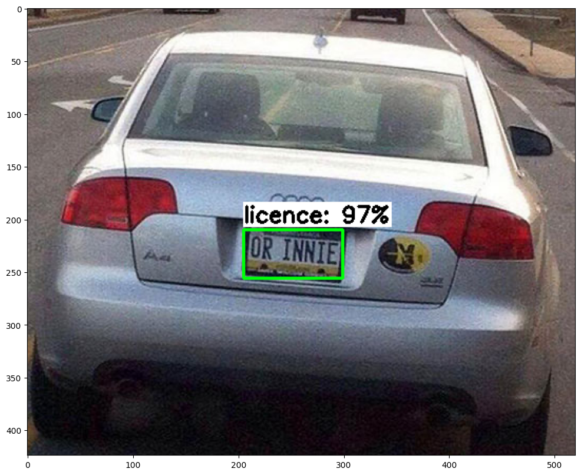
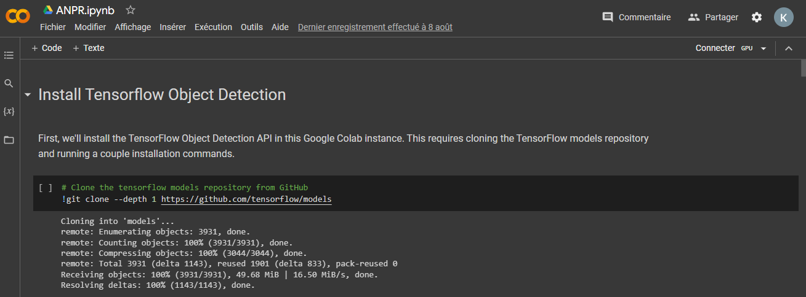
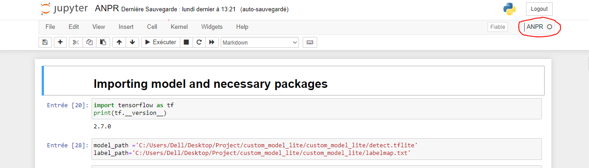

# ANPR
# Automated Number Plate Recognition (ANPR) Project



The Automated Number Plate Recognition (ANPR) Project offers an end-to-end solution for real-time license plate detection and recognition. It includes training a custom model using TensorFlow Object Detection (TFOD), license plate detection using a camera feed, and accurate number extraction using EasyOCR.

## Table of Contents

- [Overview](#overview)
- [Features](#features)
- [Getting Started](#getting-started)
  - [Prerequisites](#prerequisites)
  - [Installation](#installation)
- [Usage](#usage)
  - [Training a Custom Model](#training-a-custom-model)
  - [License Plate Detection and Number Extraction](#license-plate-detection-and-number-extraction)


## Overview

The ANPR Project seamlessly integrates TensorFlow's object detection, custom model training, license plate detection, and EasyOCR's text recognition to provide an efficient and accurate Automated Number Plate Recognition system.

## Features

- Training a custom model using TensorFlow Object Detection (TFOD).
- Real-time license plate detection using camera feed.
- Precise license plate number extraction using EasyOCR.
- TensorFlow Lite format for deployment on resource-constrained devices.

## Getting Started

### Prerequisites

- Python 3.7
- TensorFlow 2.7
- PyTorch
- EasyOCR


### Installation

1. Clone the repository:
   ```bash
   git clone https://github.com/KhalilElAmine/ANPR.git
   cd ANPR

## Usage

### Training a Custom Model
1.  open the `training.ipynb` notebook in Google Colab.

2. Download the dataset from kaggle following this link: https://www.kaggle.com/datasets/andrewmvd/car-plate-detection/codeInstead.
3. Upload the dataset to your google drive for a faster access each time you open the notebook instead of downloading it each time.
4. In case of training a custom model, replace it with your own dataset. Make sure your dataset is organized in a similar structure as the provided dataset (images and corresponding annotations).
5. Execute each cell in the notebook to train your custom ANPR model. 


### License Plate Detection and Number Extraction
To set up the environment and perform license plate detection and number extraction, follow these steps:

1. **Create and Activate Virtual Environment:**

   ```bash
   # Create a virtual environment using Python 3.7
   python3.7 -m venv ANPR
   
   # Activate the virtual environment
   source ANPR/bin/activate
   # Install ipykernel to use the virtual environment in Jupyter Notebook
   pip install ipykernel
   python -m ipykernel install --user --name=ANPR
   # Install Jupyter Notebook
   pip install jupyter
   # Install TensorFlow 2.7
   pip install tensorflow==2.7
  
   # Install PyTorch (specific version) to use easyOCR
   pip install torch==1.9.0
    ```
 2. **Open the detection notebook:**
     ```bash
     #tap the following in cmd inside your virtual environment to open jupyter notebook
       jupyter notebook
Open the detection.ipynb and switch the kernel to the created ANPR kernel.


3. **Run the License Plate Detection::**
Execute the cells in the notebook to perform license plate detection and number extraction. Customize parameters and paths as needed.

